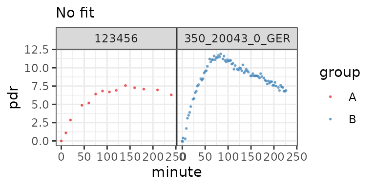
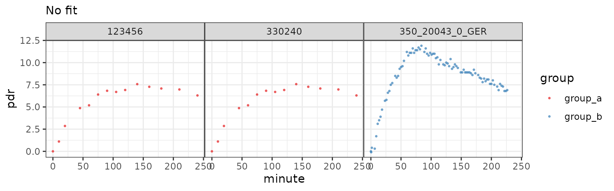
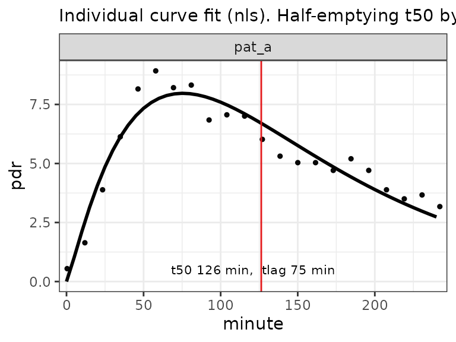
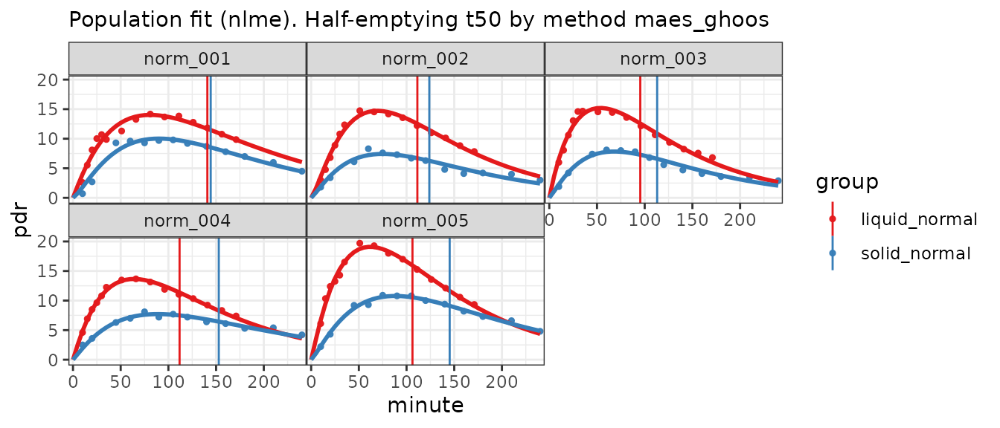
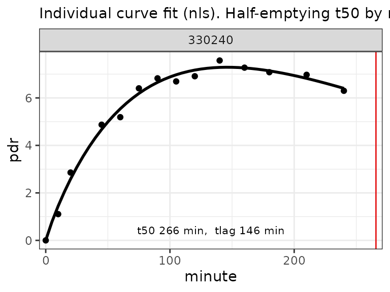

# Data formats

## Concepts

¹³C data can be imported in generic formats in Excel files, and in
several vendor-specific formats, e.g. from BreathID and Wagner/IRIS. A
collection of sample files with and without errors is available in the
directory `/opt/R/4.6.1/lib/R/library/breathtestcore/extdata`; function
[`btcore_file()`](https://dmenne.github.io/breathtestcore/reference/btcore_file.md)
retrieves the names and long path of the available data sets.

``` r

library(breathtestcore)
head(btcore_file())
```

    [1] "350_20023_0_GERWithNan.txt"       "350_20043_0_GER.txt"             
    [3] "350_20043_0_GERBadHeader.txt"     "350_20043_0_GERDuplicateTime.txt"
    [5] "350_20043_0_GERNoData.txt"        "350_20043_0_GERNoT50.txt"        

``` r

btcore_file("Standard.TXT")
```

    [1] "/home/runner/work/_temp/Library/breathtestcore/extdata/Standard.TXT"

- When you know the format, you can read the data using the special
  functions,
  e.g. [`read_breathid()`](https://dmenne.github.io/breathtestcore/reference/read_breathid.md)
  or
  [`read_breathid_xml()`](https://dmenne.github.io/breathtestcore/reference/read_breathid_xml.md).
- When you do not know the format, or when you want to read several
  different file formats at once, use function
  [`read_any_breathtest()`](https://dmenne.github.io/breathtestcore/reference/read_any_breathtest.md)
  which tries to guess the format.

``` r

files = c(
  btcore_file("IrisCSV.TXT"), # Wagner/IRIS format
  btcore_file("350_20043_0_GER.txt") # BreathID
 )
 bt = read_any_breathtest(files)
 # Returns a list of elements of class breathtest_data
 str(bt, 1)
```

    List of 2
     $ :List of 23
      ..- attr(*, "class")= chr "breathtest_data"
     $ :List of 23
      ..- attr(*, "class")= chr "breathtest_data"
     - attr(*, "class")= chr "breathtest_data_list"

``` r

 bt_df = cleanup_data(bt)
 str(bt_df)
```

    tibble [101 × 4] (S3: tbl_df/tbl/data.frame)
     $ patient_id: chr [1:101] "123456" "123456" "123456" "123456" ...
     $ group     : chr [1:101] "A" "A" "A" "A" ...
     $ minute    : num [1:101] 0.01 10 20 45 60 75 90 105 120 140 ...
     $ pdr       : num [1:101] 0 1.11 2.86 4.87 5.19 ...

Passing through
[`cleanup_data()`](https://dmenne.github.io/breathtestcore/reference/cleanup_data.md)
returns a data frame/tibble and adds a grouping variable.

To plot data without fitting, use
[`null_fit()`](https://dmenne.github.io/breathtestcore/reference/null_fit.md).

``` r

 nf = null_fit(bt_df)
 str(nf)
```

    List of 1
     $ data: tibble [101 × 4] (S3: tbl_df/tbl/data.frame)
      ..$ patient_id: chr [1:101] "123456" "123456" "123456" "123456" ...
      ..$ group     : chr [1:101] "A" "A" "A" "A" ...
      ..$ minute    : num [1:101] 0.01 10 20 45 60 75 90 105 120 140 ...
      ..$ pdr       : num [1:101] 0 1.11 2.86 4.87 5.19 ...
     - attr(*, "class")= chr [1:2] "breathtestnullfit" "breathtestfit"

``` r

 plot(nf) # dispatches to plot.breathtestfit
```



To add new formats, override
[`breathtest_read_function()`](https://dmenne.github.io/breathtestcore/reference/breathtest_read_function.md)
and add a new function that returns a structure given by
[`breathtest_data()`](https://dmenne.github.io/breathtestcore/reference/breathtest_data.md).

> Always pass data through function
> [`cleanup_data()`](https://dmenne.github.io/breathtestcore/reference/cleanup_data.md)
> to obtain a data frame that can be fed to one of the fitting functions
> [`nls_fit()`](https://dmenne.github.io/breathtestcore/reference/nls_fit.md),
> [`nlme_fit()`](https://dmenne.github.io/breathtestcore/reference/nlme_fit.md),
> [`null_fit()`](https://dmenne.github.io/breathtestcore/reference/null_fit.md)
> or
> [`breathteststan::stan_fit()`](https://dmenne.github.io/breathteststan/reference/stan_fit.html).

### Automatic grouping

You can add a grouping variable, e.g. for multiple meal types, to
compute between group differences of means. Cross-over, randomized or
mixed designs (some patients cross-over) are supported.

You must explicitlty state the grouping variable for each single file as
shown below. Without names, it is possible to vectorize,
e.g. `read_any_breathtest(c(file1, file2))`, but the ‘c()’ operator used
on vectors disambiguates the names by appending numbers.

``` r

files1 = c(
  group_a = btcore_file("IrisCSV.TXT"), # Use only single file with grouping
  group_a = btcore_file("Standard.TXT"),
  group_b = btcore_file("350_20043_0_GER.txt")
 )

# Alternative syntax using magrittr operator
suppressPackageStartupMessages(library(dplyr))
read_any_breathtest(files1) %>% 
  cleanup_data() %>% 
  null_fit() %>% 
  plot()
```



### Simulated data

Function
[`simulate_breathtest_data()`](https://dmenne.github.io/breathtestcore/reference/simulate_breathtest_data.md)
generates sample data you can use to test different algorithms. Curves
with outliers can be generated by setting `student_t_df` to values from
2 (very strong outliers) to 10 (almost gaussian).

``` r

set.seed(212)
data = list(meal_a = simulate_breathtest_data(n_records = 3, noise = 2,
                          student_t_df = 3, missing = 0.3), 
            meal_b = simulate_breathtest_data(n_records = 4))
data %>% 
  cleanup_data() %>% 
  nlme_fit() %>% 
  plot()
```


Example of a cross-over design with missing data, outliers and missing
record in the red curve.

``` r

data$meal_a$record
```

      patient_id  m       k beta t50_maes_ghoos
    1     rec_01 38 0.01310 2.41            106
    2     rec_02 47 0.00918 1.69            119
    3     rec_03 16 0.01039 2.25            128

### Built-in data sets

Three data sets are included in R format and can be loaded as shown
below. All data were provided by the University Hospital of Zürich;
details are given in the documentation.

``` r

data("usz_13c")
cat("usz_13c has data from", length(unique(usz_13c$patient_id)), "patients with" , 
    length(unique(usz_13c$group)), "different meals")
```

    usz_13c has data from 163 patients with 4 different meals

- [`breathtestcore::usz_13c`](https://dmenne.github.io/breathtestcore/reference/usz_13c.md)
  A large data set used to establish reference ranges for healthy
  volunteers and patients
- [`breathtestcore::usz_13c_a`](https://dmenne.github.io/breathtestcore/reference/usz_13c_a.md)
  Exotic data, a challenge for fitting algorthms
- [`breathtestcore::usz_13c_d`](https://dmenne.github.io/breathtestcore/reference/usz_13c_d.md)
  Has gastric emptying half time from MRI as attribute, and can used to
  compare recorded data with gold standards; see the example in the
  documentation.

## Generic formats

The easiest way to supply generic formats is from Excel files. The data
formats described in the following are shown as examples in the workbook
`/opt/R/4.6.1/lib/R/library/breathtestcore/extdata/ExcelSamples.xlsx`.
Any other tab-separated data set can directly be inserted into the
editor of the
[breathtestshiny](https://github.com/dmenne/breathtestshiny) web app
using copy/paste.

### How to use the Excel data formats

- Use function
  [`read_breathtest_excel()`](https://dmenne.github.io/breathtestcore/reference/read_breathtest_excel.md);
  this is the only way to select a worksheet different other than first
  in the workbook by passing parameter `sheet`. All other methods only
  read the first worksheet.
- Use function
  [`read_any_breathtest()`](https://dmenne.github.io/breathtestcore/reference/read_any_breathtest.md).
  This always reads the first worksheet, but you can combine results
  from several files, even when they have different formats

#### Two-column format

When you have only data from one record, you can supply data in a
two-column format as given in sheet `2col` of workboot
`ExcelSamples.xlsx`. The column headers must be \`minute,

``` r

(bt = read_breathtest_excel(btcore_file("ExcelSamples.xlsx"), "2col"))
```

    [[1]]
    
[38;5;246m# A tibble: 22 × 2
[39m
      minute   pdr
       
[3m
[38;5;246m<dbl>
[39m
[23m 
[3m
[38;5;246m<dbl>
[39m
[23m
    
[38;5;250m1
[39m   0.42 0.547
    
[38;5;250m2
[39m  11.9  1.64 
    
[38;5;250m3
[39m  23.4  3.89 
    
[38;5;250m4
[39m  34.9  6.13 
    
[38;5;246m# ℹ 18 more rows
[39m

A list is returned, and its only element is a tibble with two columns.
To create a standardized format for fitting and plotting, pass it
through `cleanup_data` which adds dummy columns `patient_id` (all
`pat_a`), and `group` (all `A`)

``` r

(cbt = cleanup_data(bt))
```

    
[38;5;246m# A tibble: 22 × 4
[39m
      patient_id group minute   pdr
      
[3m
[38;5;246m<chr>
[39m
[23m      
[3m
[38;5;246m<chr>
[39m
[23m  
[3m
[38;5;246m<dbl>
[39m
[23m 
[3m
[38;5;246m<dbl>
[39m
[23m
    
[38;5;250m1
[39m pat_a      A       0.42 0.547
    
[38;5;250m2
[39m pat_a      A      11.9  1.64 
    
[38;5;250m3
[39m pat_a      A      23.4  3.89 
    
[38;5;250m4
[39m pat_a      A      34.9  6.13 
    
[38;5;246m# ℹ 18 more rows
[39m

Compute the fit and plot

``` r

cbt %>% nls_fit() %>% plot()
```



#### Three-column format

When you have more than one patient, you must add a column `patient_id`
which may be numeric or a string.

``` r

(bt = read_breathtest_excel(btcore_file("ExcelSamples.xlsx"), "3col"))
```

    [[1]]
    
[38;5;246m# A tibble: 43 × 3
[39m
      patient_id minute   pdr
      
[3m
[38;5;246m<chr>
[39m
[23m       
[3m
[38;5;246m<dbl>
[39m
[23m 
[3m
[38;5;246m<dbl>
[39m
[23m
    
[38;5;250m1
[39m 7951500      0.42 0.547
    
[38;5;250m2
[39m 7951500     11.9  1.64 
    
[38;5;250m3
[39m 7951500     23.4  3.89 
    
[38;5;250m4
[39m 7951500     34.9  6.13 
    
[38;5;246m# ℹ 39 more rows
[39m

``` r

(cbt = cleanup_data(bt))
```

    
[38;5;246m# A tibble: 43 × 4
[39m
      patient_id group minute   pdr
      
[3m
[38;5;246m<chr>
[39m
[23m      
[3m
[38;5;246m<chr>
[39m
[23m  
[3m
[38;5;246m<dbl>
[39m
[23m 
[3m
[38;5;246m<dbl>
[39m
[23m
    
[38;5;250m1
[39m 7951500    A       0.42 0.547
    
[38;5;250m2
[39m 7951500    A      11.9  1.64 
    
[38;5;250m3
[39m 7951500    A      23.4  3.89 
    
[38;5;250m4
[39m 7951500    A      34.9  6.13 
    
[38;5;246m# ℹ 39 more rows
[39m

A dummy group ‘A’ is added by
[`cleanup_data()`](https://dmenne.github.io/breathtestcore/reference/cleanup_data.md),
so that data are in a standardized format now.

#### Four-column format

The four-column format with column names
`patient_id, group, minute, pdr` is the standard format. In cross-over
designs, you can have different groups for one patient.

``` r

bt = read_breathtest_excel(btcore_file("ExcelSamples.xlsx"), "4col_2group") %>% 
  cleanup_data()
kable(sample_frac(bt, 0.08) %>% arrange(patient_id, group), caption = "A sample from a four-column format. See worksheet 4col_2group.")
```

| patient_id | group         | minute |  pdr |
|:-----------|:--------------|-------:|-----:|
| norm_001   | liquid_normal |    105 | 14.0 |
| norm_001   | liquid_normal |     90 | 13.6 |
| norm_002   | solid_normal  |    140 |  4.8 |
| norm_003   | liquid_normal |    140 |  8.3 |
| norm_003   | solid_normal  |    180 |  3.6 |
| norm_004   | liquid_normal |     40 | 13.4 |
| norm_004   | liquid_normal |     50 | 13.5 |
| norm_004   | liquid_normal |     30 | 10.8 |
| norm_005   | liquid_normal |    180 |  8.9 |
| norm_005   | liquid_normal |    140 | 12.2 |

A sample from a four-column format. See worksheet 4col_2group. {.table}

``` r

bt %>% nlme_fit() %>% plot()
```



#### DOB instead of PDF

When you have DOB data (d), you can use `dob` instead of `pdr` as the
header of the last column. DOB data will be automatically converted to
PDR with function
[`dob_to_pdr()`](https://dmenne.github.io/breathtestcore/reference/dob_to_pdr.md).
Since no body weight and height are given, the defaults of 75kg and 180
cm are assumed.

The half-emptying time and lags do not depend on this assumptions. Only
the parameter `m` of the fit which normalized area and amplitude, is
affected, and I do not know of a case the `m` has been used in clinical
practice.

## Vendor-specific formats

#### IRIS-Wagner composite data

The first lines of `IrisMulti.TXT`

    "Testergebnis"
    "Nummer","22"
    "Datum","12.06.2009"
    "Testart"
    "Name","Magenentleerung fest"
    "Abkürzung","GE FEST"
    "Substrat","Natriumoktanoat"

Use
[`read_iris()`](https://dmenne.github.io/breathtestcore/reference/read_iris.md)
or
[`read_any_breathtest()`](https://dmenne.github.io/breathtestcore/reference/read_any_breathtest.md)
:

``` r

read_iris(btcore_file("IrisMulti.TXT")) %>% 
  cleanup_data() %>% 
  null_fit() %>% 
  plot()
```


IRIS/Wagner composite file. These data cannot be fitted successfully
with the single-curve fit method, therefore only data are shown.

#### IRIS/Wagner CSV format

Files in this format start like this (lines shortened …)

    "Name","Vorname","Test","Identifikation","Testzeit[min]",...
    "Einstein","Albert","GE FEST","330240","0","0","-26.32","4.501891E-02", ...
    "Einstein","Albert","GE FEST","330240","10","2.02","-24.3","5.617962E-02","2.391013",..
    "Einstein","Albert","GE 

Use
[`read_iris_csv()`](https://dmenne.github.io/breathtestcore/reference/read_iris_csv.md)
or
[`read_any_breathtest()`](https://dmenne.github.io/breathtestcore/reference/read_any_breathtest.md)
:

``` r

read_iris_csv(btcore_file("Standard.TXT")) %>% 
  cleanup_data() %>% 
  nls_fit() %>% 
  plot()
```



IRIS/Wagner CSV file

#### BreathID composite format

Files in this format start like this

    Test and Patient parameters                 

                        
    Date           -    12/11/12                    
    End time       -    08:54                   
    Start time     -    12:49                   
    Patient # - 0       
    Patient ID   - Franz                    

Use
[`read_breathid()`](https://dmenne.github.io/breathtestcore/reference/read_breathid.md)
or
[`read_any_breathtest()`](https://dmenne.github.io/breathtestcore/reference/read_any_breathtest.md):

``` r

read_breathid(btcore_file("350_20043_0_GER.txt")) %>% 
  cleanup_data() %>% 
  nls_fit() %>% 
  plot()
```


BreathID composite file

#### BreathID XML format

The more recent XML format from BreathID can contain data from multiple
record and starts like this:

    <Tests Device="1402">
      <Test Number="2">
        <ID>TEST123</ID>
        <DOB>N/A</DOB>
        <StartTime>19Jul2017 11:56</StartTime>
        <EndTime>19Jul2017 12:12</EndTime>
        <LastResultCode>0</LastResultCode>
        <StoppedByUser>true</StoppedByUser>
      </Test>
      <Test Number="3">
        <ID>45689</ID>
        <StartTime>19Jul2017 12:22</StartTime>
        <EndTime>19Jul2017 12:29</EndTime>
        <LastResultCode>0</LastResultCode>

Use
[`read_breathid_xml()`](https://dmenne.github.io/breathtestcore/reference/read_breathid_xml.md)
or
[`read_any_breathtest()`](https://dmenne.github.io/breathtestcore/reference/read_any_breathtest.md):

``` r

read_breathid_xml(btcore_file("NewBreathID_multiple.xml")) %>% 
  cleanup_data() %>% 
  nls_fit() %>% 
  plot()
```


BreathID XML format

Grouping is most useful in a cross-over design to force within-subject
comparisons by functions
[`coef_by_group()`](https://dmenne.github.io/breathtestcore/reference/coef_by_group.md)
and
[`coef_diff_by_group()`](https://dmenne.github.io/breathtestcore/reference/coef_diff_by_group.md);
in the above case, the default grouping above might not be what you
required. Replace the group parameter manually to remove the groups, but
do not delete the column with `group = NULL`, because the fitting
functions requires a dummy group name.

``` r

# Could also use read_any_breathtest()
read_breathid_xml(btcore_file("NewBreathID_multiple.xml")) %>% 
  cleanup_data() %>% 
  mutate(
    group = "New"
  ) %>% 
  nls_fit() %>% 
  plot()
```


BreathID XML format with manual grouping.
