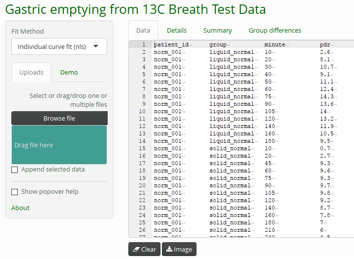

# Concepts

<sup>13</sup>C data can be imported in generic formats in Excel files, and in several vendor-specific formats, e.g. from BreathID and Wagner/IRIS. A collection of sample files with and without errors is available in the directory ``r R.home()`/library/breathtestcore/extdata`; function `btcore_file()` retrieves the names and long path of the available data sets. 

```{r, echo = FALSE, include = FALSE}
library(knitr)
library(dplyr)
library(stringr)
opts_chunk$set(comment = NA, fig.width = 4, fig.height = 3)
knitr::opts_knit$set(unnamed.chunk.label = "btcore_data_")
options(digits = 3)
```

```{r}
library(breathtestcore)
head(btcore_file())
btcore_file("Standard.TXT")
```

* When you know the format, you can read the data using the special functions, e.g. `read_breathid()` or `read_breathid_xml()`. 
* When you do not know the format, or when you want to read several different file formats at once, use function `read_any_breathtest()` which tries to guess the format. 

```{r}
files = c(
  btcore_file("IrisCSV.TXT"), # Wagner/IRIS format
  btcore_file("350_20043_0_GER.txt") # BreathID
 )
 bt = read_any_breathtest(files)
 # Returns a list of elements of class breathtest_data
 str(bt, 1)
 bt_df = cleanup_data(bt)
 str(bt_df)
```
Passing through `cleanup_data()` returns a data frame/tibble and adds a grouping variable. 

To plot data without fitting, use `null_fit()`.


```{r, nf, fig.height = 2, fig.width =4}
 nf = null_fit(bt_df)
 str(nf)
 
 plot(nf) # dispatches to plot.breathtestfit
```

To add new formats, override  `breathtest_read_function()` and add a new function that returns a structure given by `breathtest_data()`.

> Always pass data through function `cleanup_data()` to obtain a data frame that can be fed to one of the fitting functions `nls_fit()`, `nlme_fit()`, `null_fit()` or `breathteststan::stan_fit()`.

## Automatic grouping

You can add a grouping variable, e.g. for multiple meal types, to compute between group differences of means. Cross-over, randomized or mixed designs (some patients cross-over) are supported.

You must explicitlty state the grouping variable for each single file as shown below. Without names, it is possible to vectorize, e.g. `read_any_breathtest(c(file1, file2))`, but the 'c()' operator used on vectors disambiguates the names by appending numbers.   

```{r, three, fig.height = 2.5, fig.width = 8}
files1 = c(
  group_a = btcore_file("IrisCSV.TXT"), # Use only single file with grouping
  group_a = btcore_file("Standard.TXT"),
  group_b = btcore_file("350_20043_0_GER.txt")
 )

# Alternative syntax using magrittr operator
suppressPackageStartupMessages(library(dplyr))
read_any_breathtest(files1) %>% 
  cleanup_data() %>% 
  null_fit() %>% 
  plot()
```


## Simulated data

Function `simulate_breathtest_data()` generates sample data you can use to test different algorithms. Curves with outliers can be generated by setting `student_t_df` to values from 2 (very strong outliers) to 10 (almost gaussian). 

```{r, simulated,  fig.height = 5, fig.width = 6, fig.cap = "Example of a cross-over design with missing data, outliers and missing record in the red curve."}
set.seed(212)
data = list(meal_a = simulate_breathtest_data(n_records = 3, noise = 2,
                          student_t_df = 3, missing = 0.3), 
            meal_b = simulate_breathtest_data(n_records = 4))
data %>% 
  cleanup_data() %>% 
  nlme_fit() %>% 
  plot()

```

```{r, fig.cap= "Function simulate_breathtest_data returns the values of the parameters used to generate the data. These can be used to check the results of the model prediction."}
data$meal_a$record
```

## Built-in data sets

Three data sets are included in R format and can be loaded as shown below. All data were provided by the University Hospital of Zürich; details are given in the documentation.

```{r}
data("usz_13c")
cat("usz_13c has data from", length(unique(usz_13c$patient_id)), "patients with" , 
    length(unique(usz_13c$group)), "different meals")
```

* `breathtestcore::usz_13c` A large data set used to establish reference ranges for healthy volunteers and patients
* `breathtestcore::usz_13c_a` Exotic data, a challenge for fitting algorthms
* `breathtestcore::usz_13c_d` Has gastric emptying half time from MRI as attribute, and can used to compare recorded data with gold standards; see the example in the documentation.

# Generic formats

The easiest way to supply generic formats is from Excel files. The data formats described in the following are shown as examples in the workbook ``r R.home()`/library/breathtestcore/extdata/ExcelSamples.xlsx`. Any other tab-separated data set can directly be inserted into the editor of the [breathtestshiny](https://github.com/dmenne/breathtestshiny) web app using copy/paste.

## How to use the Excel data formats

* Use function `read_breathtest_excel()`; this is the only way to select a worksheet different other than first in the workbook by passing parameter `sheet`. All other methods only read the first worksheet.
* Use function `read_any_breathtest()`. This always reads the first worksheet, but you can combine results from several files, even when they have different formats

```{r, fig.height = 3, include = FALSE}

```

### Two-column format

When you have only data from one record, you can supply data in a two-column format as given in sheet `2col` of workboot `ExcelSamples.xlsx`. The column headers must be `minute, 
```{r, echo = FALSE, include = FALSE}
options(tibble.print_min= 4)
options(digits = 2)
```

```{r}
(bt = read_breathtest_excel(btcore_file("ExcelSamples.xlsx"), "2col"))
```

A list is returned, and its only element is a tibble with two columns. To create a standardized format for fitting and plotting, pass it through `cleanup_data` which adds dummy columns `patient_id` (all `pat_a`), and `group` (all `A`)

```{r}
(cbt = cleanup_data(bt))
```

Compute the fit and plot

```{r, nlsfit, height = 3, width = 4}
cbt %>% nls_fit() %>% plot()
```


### Three-column format

When you have more than one patient, you must add a column `patient_id` which may be numeric or a string.

```{r}
(bt = read_breathtest_excel(btcore_file("ExcelSamples.xlsx"), "3col"))
```


```{r}
(cbt = cleanup_data(bt))
```
A dummy group 'A' is added by `cleanup_data()`, so that data are in a standardized format now.

### Four-column format

The four-column format with column names `patient_id, group, minute, pdr` is the standard format. In cross-over designs, you can have different groups for one patient. 

```{r, four_col "}
bt = read_breathtest_excel(btcore_file("ExcelSamples.xlsx"), "4col_2group") %>% 
  cleanup_data()
kable(sample_frac(bt, 0.08) %>% arrange(patient_id, group), caption = "A sample from a four-column format. See worksheet 4col_2group.")

```


```{r, nlme_fit, fig.width = 7}
bt %>% nlme_fit() %>% plot()
```


### DOB instead of PDF

When you have DOB data (d), you can use `dob` instead of `pdr` as the header of the last column. DOB data will be automatically converted to PDR with function `dob_to_pdr()`. Since no body weight and height are given, the defaults of 75kg and 180 cm are assumed. 

The half-emptying time and lags do not depend on this assumptions. Only the parameter `m` of the fit which normalized area and amplitude, is affected, and I do not know of a case the `m` has been used in clinical practice.


# Vendor-specific formats

### IRIS-Wagner composite data

The first lines of `IrisMulti.TXT`

```
"Testergebnis"
"Nummer","22"
"Datum","12.06.2009"
"Testart"
"Name","Magenentleerung fest"
"Abkürzung","GE FEST"
"Substrat","Natriumoktanoat"
```

Use `read_iris()` or `read_any_breathtest()` :

```{r, iriswagner, fig.cap = "IRIS/Wagner composite file. These data cannot be fitted successfully with the single-curve fit method, therefore only data are shown."}
read_iris(btcore_file("IrisMulti.TXT")) %>% 
  cleanup_data() %>% 
  null_fit() %>% 
  plot()
```

### IRIS/Wagner CSV format

Files in this format start like this (lines shortened ...)

```
"Name","Vorname","Test","Identifikation","Testzeit[min]",...
"Einstein","Albert","GE FEST","330240","0","0","-26.32","4.501891E-02", ...
"Einstein","Albert","GE FEST","330240","10","2.02","-24.3","5.617962E-02","2.391013",..
"Einstein","Albert","GE 
```

Use `read_iris_csv()` or `read_any_breathtest()` :

```{r, iris_csv, fig.cap = "IRIS/Wagner CSV file"}
read_iris_csv(btcore_file("Standard.TXT")) %>% 
  cleanup_data() %>% 
  nls_fit() %>% 
  plot()
```
### BreathID composite format

Files in this format start like this

```
Test and Patient parameters					

					
Date           -    12/11/12					
End time       -    08:54					
Start time     -    12:49					
Patient # - 0		
Patient ID   - Franz 					

```

Use `read_breathid()` or `read_any_breathtest()`:

```{r, breathidc, fig.cap = "BreathID composite file"}
read_breathid(btcore_file("350_20043_0_GER.txt")) %>% 
  cleanup_data() %>% 
  nls_fit() %>% 
  plot()
```


### BreathID XML format

The more recent XML format from BreathID can contain data from multiple record and starts like this:

```
<Tests Device="1402">
  <Test Number="2">
    <ID>TEST123</ID>
    <DOB>N/A</DOB>
    <StartTime>19Jul2017 11:56</StartTime>
    <EndTime>19Jul2017 12:12</EndTime>
    <LastResultCode>0</LastResultCode>
    <StoppedByUser>true</StoppedByUser>
  </Test>
  <Test Number="3">
    <ID>45689</ID>
    <StartTime>19Jul2017 12:22</StartTime>
    <EndTime>19Jul2017 12:29</EndTime>
    <LastResultCode>0</LastResultCode>
``` 


Use `read_breathid_xml()` or `read_any_breathtest()`:

```{r, breathid_xml, fig.cap = "BreathID XML format"}
read_breathid_xml(btcore_file("NewBreathID_multiple.xml")) %>% 
  cleanup_data() %>% 
  nls_fit() %>% 
  plot()
```

Grouping is most useful in a cross-over design to force within-subject comparisons by functions `coef_by_group()` and `coef_diff_by_group()`; in the above case, the default grouping above might not be what you required. Replace the group parameter manually to remove the groups, but do not delete the column with `group = NULL`, because the fitting functions requires a dummy group name.

```{r, breathid_man, fig.cap = "BreathID XML format with manual grouping."}
# Could also use read_any_breathtest()
read_breathid_xml(btcore_file("NewBreathID_multiple.xml")) %>% 
  cleanup_data() %>% 
  mutate(
    group = "New"
  ) %>% 
  nls_fit() %>% 
  plot()
```